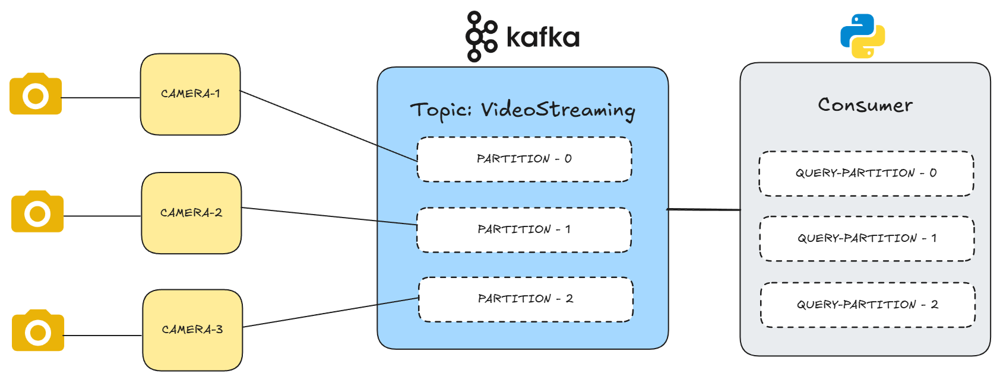

# Kafka Camera Streaming Simulation

## Table of Content

- [Overview](#overview)
- [Challenges](#challenges)
- [Approaches](#approaches)
- [Architecture](#architecture)
- [How to run](#how-to-run)

## Overview

This repository provides setup instructions for using **Kafka** as an event broker to manage connections between multiple camera sources and an AI violence detection model.

Currently, _the AI model is not integrated._ For now, the consumer simply displays video frames received from each Kafka topic partition. Each partition corresponds to a separate camera source (i.e., producer).

## Challenges

Kafka supports video streaming by transmitting each frame as a byte array. However, this creates a challenge:
To perform inference effectively, the model requires an ordered list of frames from the same source instead of 1 seperate frame.

## Approaches

There are two approaches to address this issue:

_1. Use Kafka message keys:_

Assign a unique key to each source. Frames with the same key are grouped by Kafka to maintain order from the same origin.

_2. Use separate partitions for each source (selected approach):_

Assign each producer (camera source) to a distinct Kafka partition. During processing, filter the streaming DataFrame (streamDF) by partition. This way, each partition serves as a dedicated input stream for a specific source.

> [!NOTE]
> ✅ We chose the second approach due to its better scalability and simplified stream management.

## Architecture

The diagram above illustrates the architecture of a Kafka-based video streaming system designed to route frames from multiple camera sources to an AI model for violence detection _(model integration is pending)_.



### Components

_1. Producers (Cameras)_

Each camera source acts as a Kafka producer.

> For demo purposes, the system simulates three cameras: CAMERA-1, CAMERA-2, and CAMERA-3.

Each camera sends its video stream as a sequence of byte-encoded frames to Kafka.

_2. Kafka Topic: VideoStreaming_

All frames are streamed into a single Kafka topic named VideoStreaming.

> The topic is divided into three partitions:
>
> - PARTITION-0 for CAMERA-1
> - PARTITION-1 for CAMERA-2
> - PARTITION-2 for CAMERA-3

This partition-per-camera strategy enables ordered delivery per source and allows the system to scale horizontally by adding more partitions and camera producers.

_3. Consumer (Python + Apache Spark)_

The consumer is implemented using Spark Structured Streaming. It subscribes to the VideoStreaming topic using Kafka’s default consumption strategy.

> The stream is processed using three separate queries, each filtering by partition:
>
> - QUERY-PARTITION-0
> - QUERY-PARTITION-1
> - QUERY-PARTITION-2

These queries represent three independent input queues, each corresponding to one camera source. These will later serve as input streams for the AI violence detection model.

## How To Run?

This is the instruction how to run this project on window. The command when running server is different for linux users.

### Prerequisites

Before running the project, make sure you have the following installed and configured:

- Java _(version: 8.0)_
- Apache Spark
- Apache Kafka

Environment Variables Configured:

- `JAVA_HOME`
- `SPARK_HOME`
- `HADOOP_HOME`

Ensure Scala version compatibility between Spark and Kafka.

> [!CAUTION]
> You may need to set the Scala version in your SparkSession to 2.12 if you’re using Kafka 2.12.

> [!INFO] > [This is the Kafka version that I used](https://downloads.apache.org/kafka/3.9.0/kafka_2.13-3.9.0.tgz)
>
> After downloading, extract the downloaded file to a convenient directory (e.g., C:/):

### Starting Server

```powershell
# change to the kafka directory
cd C:\kafka_2.13-3.9.0

# running zookeeper
.\bin\windows\zookeeper-server-start.bat .\config\zookeeper.properties
```

In a new terminal, running the kafka server by running:

```powershell
# change to the kafka directory
cd C:\kafka_2.13-3.9.0

# running kafka-server
.\bin\windows\kafka-server-start.bat .\config\server.properties
```

### Running Producer

The producer simulates a camera by sending video frames (as byte arrays) into Kafka partitions.
To run 3 instances of camera:

```powershell
python Camera-Producer.py 1 # first instance
python Camera-Producer.py 2 # second instance
python Camera-Producer.py 3 # third instance
```

### Running Consumer

Running the StreamingQueries scripts to see the effects.
